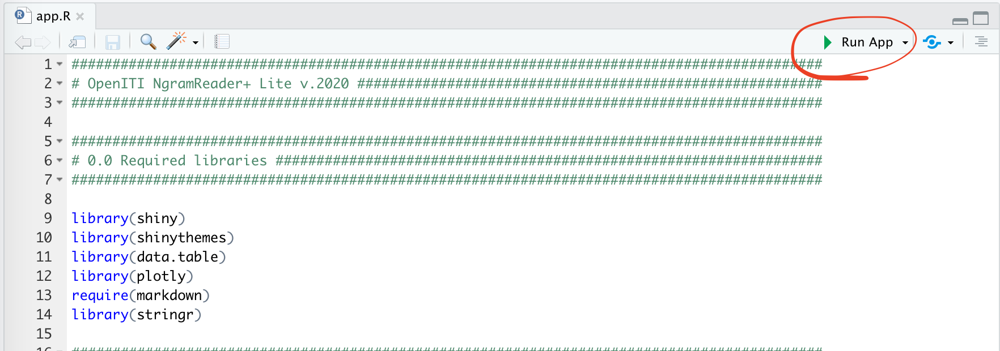

## OpenITI NgramReader+ v.2020

Like *Google Ngram Viewer* (<https://books.google.com/ngrams>), **OpenITI NgramReader+** charts diachronic frequencies of words and phrases, using the data of the OpenITI corpus (Arabic data only). Unlike `Google Ngram Viewer`, however, **OpenITI NgramReader+** allows one to combine ngrams, which helps to combine different morphological forms together, and to explore classes of objects. Why to combine forms? Arabic morphology is complex and the same word can appear in a large variety of forms: for example, *kitāb*, *al-kitāb*, *wa-kitāb*, *wa-l-kitāb* are instances of the same lemma and one might want to combine all or only some forms into a single entity. **OpenITI NgramReader+** allows one to do that with `regular expressions`. This approach also allows one to create thematic clusters of words. For example, one can combine *Baġdād* and *Madīnaŧ al-salām* in order to get all mentions of the ʿAbbāsid capital; or, to combine together all cities of Ḫurāsān in order to gauge frequencies of references to Ḫurāsān in general.

## Versions

There are three versions of the **OpenITI NgramReader+**:

- Lite (al-Ṣuġrá) includes only unigrams with frequencies 3 and higher
- Medium (al-Wusṭá) includes unigrams (5 and higher) and bigrams (10 and higher)
- Full (al-Kubrá) includes unigrams (3 and higher) and bigrams (5 and higher)

Lite version is available online at <https://maximromanov.shinyapps.io/OpenITI_NgramReaderPlus_Lite/>; the other two versions can be downloaded and run locally (see below for details).

**Note**. A *token* is a word form as it occurs in a text. A *unigram* is a single token from a text. For example, the previous sentence breaks into the following unigrams/tokens: `A`, `unigram`, `is`, `a`, `single`, `token`, `from`, `a`, `text`. A *bigram* is an overlapping sequence of two tokens: `A bigram`, `bigram is`, `is an`, `an overlapping`, `overlapping sequence`, `sequence of`, ... etc.

## Searching

Syntax for the searches is as follows: `#ItemForTheLegend #SearchItem1 #SearchItem2 #SearchItemN`, that is each item must begin with `#`. The search string will be reformatted and added to the legend of a graph. `#ItemForTheLegend` is not a search item, but the main readable item to be shown on the legend of the graph; all items that follow it will be combined into a `regular expression` for searching. These will also be added into the legend as a search reference. For example, if you were to look for mentions of Baġdād, the search line would look like `#Baġdād #bgdAd #bbgdAd #wbgdAd #wbbgdAd`, which will be reformatted into "**Baġdād** (RE: `bgdAd|bbgdAd|wbgdAd|wbbgdAd`)" and added to the legend on the graph. (Keep in mind the legend will appear only if there is more than one search line.).

Arabic text data has been converted into a simplified version of Buckwalter transliteration.

*Regular expressions*. The search supports `regular expressions` which make things more concise and robust. For example, `#Baġdād #bgdAd #bbgdAd #wbgdAd #wbbgdAd` can become significantly shorter if regular expressions are used: `#Baġdād #[wb]*bgdAd`. Regular expressions are particularly valuable for taking into account all possible combinations of prefixes and suffixes. Thus, adding `[wfbl]*[Al]*` in front of the word you are looking for, the search line will find that word with all possible prefixes in addition to its bare form. For example, `[wfbl]*(A?l)*ktAb` finds 17 different forms of the word `kitāb` (in order of frequencies): *kitāb*, *al-kitāb*, *wa-kitāb*, *bi-kitāb*, *bi-l-kitāb*, *wa-l-kitāb*, *fa-l-kitāb*, *fa-kitāb*, *wa-bi-l-kitāb*, *wa-bi-kitāb*, *fa-bi-l-kitāb*, *fa-bi-kitāb*, etc. In a similar way, `(h(A|mA?|n)?|k(n|mA?))?` will find all variants of a word with all pronominal suffixes. You, of course, can combine both—`[wfbl]*(A?l)*ktAb(h(A|mA?|n)?|k(n|mA?))?`. Give it a try! You will get a detailed table of results at the bottom of the page: the graph will combine about 50 different items into one curve.

**NB:** To understand how `regular expressions` work, you can start with this online tutorial: [http://regexone.com/](http://regexone.com/)).

## Ngram Graphs and Ngram Table Tabs

After you click "Generate graph..." on the **Ngram Graphs** Tab, two graphs---one with relative and another with absolute frequencies---will be generated. Each graph can be downloaded and saved in `SVG` format using a button that looks like a camera, which will appear in the top-right corner of the graph if you hover over the graph (see a screenshot below).

`SVG` files can be open in a browser (drag-and-drop on your browser window) or in any editor that works with vector images (Adobe Illustrator, SVG-Edit, Inkscape, Affinity Designer, GIMP, etc.). A timestamp is automatically added to the file name (the date is also added to the lower part of the graph). The image below shows a downloaded `SVG` file:

On the **Ngram Data Table** Tab you will find all the results that matched your searches. You can use this table to look into the distribution of different word forms as well as to make sure that your searches catch exactly what you need. A screenshot of a table is below:

## Arabic Corpus Data: OpenITI, ver. 2019.1.1 

Current version of **OpenITI NgramReader+** is based on texts from the OpenITI corpus (**OpenITI, ver. 2019.1.1** [DOI:10.5281/zenodo.3082464](https://doi.org/10.5281/zenodo.3082464)), which includes ~4,300 unique works (~700 million words). The following graph shows the chronological distribution of works in this release of the OpenITI corpus.

## Diachronic Ngram Data

Diachronic ngram data for the **OpenITI NgramReader+** was generated in the following manner:

1. Each text from the OpenITI corpus was first converted into frequency lists of unigrams (tokens) and bigrams---one list per work. In cases of multiple versions of the same work, only versions tagged as `pri` (*primary*) were used.
2. These frequency lists were then combined into one unifies frequency list, which includes over 2 mln unique unigrams and over 85 mln unique bigrams. This list was then used to filter out low frequency items. For example, the number of unigrams that occur at least 3 times in the entire corpus is slightly over 1 mln (i.e., ~50%); the number of bigrams with frequencies 5 and higher is less than 10 mln (i.e. ~12%). Removing low frequency items significantly reduces the size of data.
3. Filtered data (without low frequency items) was then reformatted into diachronic data---with freqiencies for each item calculated for each 50AH period. Authors death dates were used as initial dates which were then rounded up to the next divisible of 50 (597 becomes 600, 1347 becomes 1350, etc.)  
4. Three main datasets were generated in this manner. These are used in different versions of the NgramReader+.
5. Arabic script was converted into simplified Buckwalter transliteration. Transliteraion allows to reduce the size of data and makes writing searches simpler.

**Note**. A *token* is a word form as it occurs in a text. A *unigram* is a single token from a text. For example, the previous sentence breaks into the following unigrams/tokens: `A`, `unigram`, `is`, `a`, `single`, `token`, `from`, `a`, `text`. A *bigram* is an overlapping sequence of two tokens: `A bigram`, `bigram is`, `is an`, `an overlapping`, `overlapping sequence`, `sequence of`, ... etc.

## Running OpenITI NgramReader+ locally

1. All three versions of the application can be downloaded from Zenodo and run locally.
1. You need to install R and RStudio
1. Run the following line in R Console in order to install required libraries:
`install.package(c("shiny", "shinythemes", "data.table", "plotly", "markdown", "stringr")`
1. open `app.R` in the folder of desired version of **OpenITI NgramReader+ v.2020**
1. click button `> Run app`.

## Suggested Citation

Maxim Romanov. (2020) *OpenITI NgramReader+* (Version 2020.1). [Software + Data set]. Zenodo: <http://doi.org/10.5281/zenodo.3725855>

